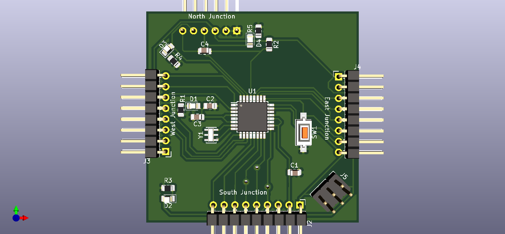

# Square Simpino Bare Minimum Configuration

## Introduction
The main intention of this circuit is to have only bare minimum components. 
the Entire circuit will be placed in a square form factor, unlike the traditional arduino with rail configuration so that the connection to other components becomes easy. 
 
This design is highly influenced by the FabLab design for the similar circuit, Thanks to MIT fab lab for putting their circuit online and available to everyone. 

The entire circuit is plotted on a 50mm X 50mm square.

The square has 4 junctions with connectors on each side, as shown in the figure below. 

## To program
### Via ISP
connect the headers connections named on the backside of the board to associated pins on the ISP programmers such as USB ISP or avr isp etc.., Select the programer on the Arduino IDE and hit the program via external programer. 

### Via Bootloader. 
#### For the first time use

Use the ISP method to burn the boot loader to the IC chip. the advantage of using the ISP method is it give faster boot time as compared to the bootloader method. 

#### Bootloader
use the connect the serial headers to serial headers of CH340 or FTDI chipset and use as normal arduino uno or arduino nano. 
